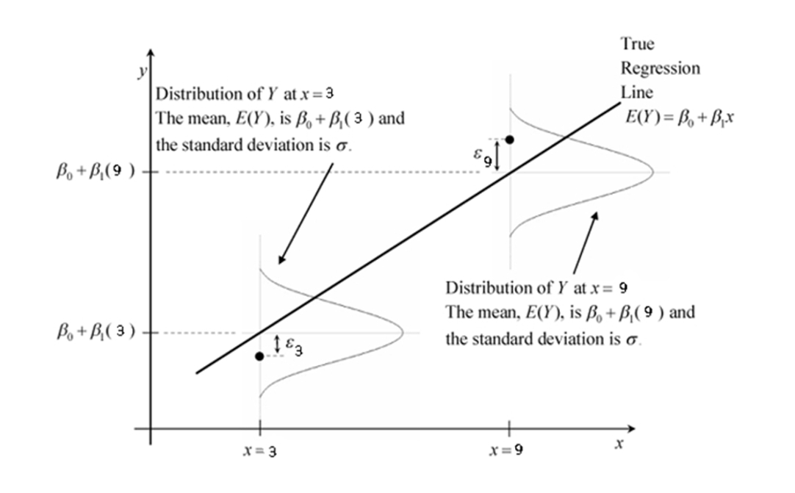

# Lecture 3: Simple linear Regression 


:::: {.blackbox data-latex=""}
::: {.center data-latex=""}
**Learning outcomes**
:::

Understand basic concepts necessary for simple linear regression such as:
<ul>
  <li>lines</li>
  <li>least squares estimates</li>
  <li>intercept</li>
  <li>slope</li>
  <li>coefficients</li>
</ul>

Understand diagnostics such as:
<ul>
  <li>Significance of regression coefficients</li>
  <li>$R^2$ statistics</li>
  <li>residual standard deviation</li>
</ul>
::::


## Why linear regression?

The aim of linear regression is to fit the relationship between a predictor and an outcome as a _straight line_ with coefficients obtained using _least squares estmation_. There are a number of advantages to linear regression:

* lines are easy to understand/interpret.
* lines are easy to fit: least squares regression has easy to calculate formulae for the estimates of the intercept and the slope.
* together with assumptions about the normality of $y$ linear regression can lead to relatively easy checks to ensure that the model is appropriate. 
* The theory for Hypothesis tests is straightforward.

**How are lines defined in this context:**

A straight line on a graph with an $x$ and $y$ axis is given by $y = \beta_0+\beta_1 x$. 

* The line crosses the $y$ axis at $\beta_0$: the value for $y$ at $x=0$ is $\beta_0$. $\beta_0$ is termed the _intercept_
* The line has a _slope/gradient_ of $\beta_1$: an increase in $x$ of 1 results in a change of $\beta_1$ in y


## Terminology

We will use the following terminology

* A predictor is usually termed $x$ (with subscripts if more than one) or given a name e.g. "age" 
* The outcome is typically termed $y$ or given a name e.g. "hourpay"
* $\beta$ is the "true" coefficient, $\sigma$ is the "true" standard deviation
* Adding a "hat" $\hat{}$   indicates an _estimate_ rather than the true underlying value (e.g. $\hat{\beta}$ or $\hat{y_i}$)

## Estimation

<!-- Below is a plot of 10 data points. The mean of $x$ is 6.97 and the mean of $y$ is 39.15. The line going through the plot is the least squares estimate line (more later). It has intercept 8.2 and slope 4.4 -->

Below is a plot of 15 data points which relate the number of hours of independent study per week = x on the x-axis to the average grade (%) in final exams = y on the y-axis for a subset of LSE students:

```{r fig.width=5, fig.asp=0.7}
lse.dat<-read.csv("lsehwk3.csv")
with(lse.dat, plot(x,y, xlim=c(0,15),ylim=c(0,80)))
```

On the plot draw what you think is the line of best fit. Based on this line take a guess at the intercept and the slope. I'm going to guess the intercept it 0 and the slope is 4

$$ \hat{y}_i = 0 + 4 x_i $$

**"Gue-Estimates"**

My guesses are (crude) _estimates_ of the parameters $\beta_0$ and $\beta_1$ which we term $\hat{\beta_0}$ and $\hat{\beta_1}$. They are estimates rather than the "true" parameters because 

1. our sample is too small (there are only 15 points)
2. we always measure with error (in this case y has been measured using a survey so they are subject to recall bias)
3. are there really any true values? The best possible linear model is at most a good approximation
4. we are guessing (as opposed to estimating the parameters using techniques which have good mathematical and statistical properties :unbiased, converging to the true value etc.)

## Least squares estimates

Points 1, 2 and 3 are true for least squares estimates too. However they are not a "guess", they are the best estimates possible given the data. 
Formally, least squares estimates of the coefficients are those that _minimize_ the _sum_ of the _squares_ of the _observed vertical distance_ (termed residual) between the points and the line.  We could also minimise the sum of the absolute value of the vertical distances. We prefer the _square_ because:

- it has better mathematical properties (it is easy to take a derivative of a square) 
- it penalises points that are further away more than an absolute value.

In the plot below draw two lines -- one that fits better and another that fits poorly and see how that changes the size of the squares of the vertical distance from the line to the point.

```{r fig.width=10, fig.asp=0.4}
par(mfrow=c(1,2))
lse.dat<-read.csv("lsehwk3.csv")
with(lse.dat, plot(x,y, xlim=c(0,15),ylim=c(0,80)))
with(lse.dat, plot(x,y, xlim=c(0,15),ylim=c(0,80)))
```

As an aside the least squares line goes through $\bar{x}$ and $\bar{y}$ the means(averages) of $x$ and  $y$ respectively 

## The residuals

The vertical distance between the line of fit and the observed value is called the _residual_. The residuals can be thought of as representing the error in the regression. The bigger they are the worse the fit of the line to the data. Formally:

$$ r_i= y_i - \hat{y_i} = y_i- (\hat{\beta_0}+\hat{\beta_1}x_i) $$
 
or in the case of our guess:

$$ \begin{aligned}
r_i & = y_i - (\hat{\beta_0}+\hat{\beta_1}y_i)\\  & = y_i - (0 +  4 x_i) 
\end{aligned}$$


**Sum of Squares of the error (residuals)**

Formally in least squares estimation the quantity that has to me minimised with respect to the parameters $\beta_0$ and $\beta_1$ is:

$$
\begin{aligned}
SSE= &  \sum r_i^2  \\
 =  & \sum [y_i - (\hat{\beta_0}+\hat{\beta_1}x_i)]^2 
\end{aligned}
$$

You will find on Moodle a video with the formal derivation of the least squares estimates using calculus. You *MUST* learn this as something related to this is almost always on the exam.

**Exercise**

Below are 4 very simple plots. Draw the line that you think will be best for predicting $y$ from $x$.  

```{r echo=FALSE, fig.asp=0.8, fig.width=7}
par(mfrow=c(2,2))
plot(c(1,2,3),c(1,2,3),xlim=c(0,3.5),ylim=c(0,3.5),axes=FALSE,xlab="",ylab="")
axis(1,at = c(0,1,2,3),labels=c(0,1,2,3))
axis(2,at = c(0,1,2,3),labels=c(0,1,2,3))
text(0,3,"A",cex=1.2)
plot(c(1,1,2),c(1,2,2),xlim=c(0,3.5),ylim=c(0,3.5),axes=FALSE,xlab="",ylab="")
axis(1,at = c(0,1,2,3),labels=c(0,1,2,3))
axis(2,at = c(0,1,2,3),labels=c(0,1,2,3))
text(0,3,"B",cex=1.2)
plot(c(1,2,1,2),c(1,1,2,2),xlim=c(0,3.5),ylim=c(0,3.5),axes=FALSE,xlab="",ylab="")
axis(1,at = c(0,1,2,3),labels=c(0,1,2,3))
axis(2,at = c(0,1,2,3),labels=c(0,1,2,3))
text(0,3,"C",cex=1.2)
plot(c(1,2,3,3,4,5),c(2,3,3,1,2,3),xlim=c(0,6),ylim=c(0,4),axes=FALSE,xlab="",ylab="")
axis(1,at = c(0,1,2,3,4,5,6),labels=c(0,1,2,3,4,5,6))
axis(2,at = c(0,1,2,3,4),labels=c(0,1,2,3,4))
text(0,3.8,"D",cex=1.2)
```

Below are the equations estimated from these data using least squares estimation. Use the four least squares equations to _predict_  $y$ for $x= \{0,3\}$. Then draw a line through the two points in a different colour: this will be your line of best fit using least squares estimation.

* A: $y = 0 + x$
* B: $y = 1 + 0.5 x$
* C: $y = 1.5 + 0 x$
* D: $y = 2 + 0.1 x$

<table>
    <tr>
        <td>x</td>
        <td>A</td>
        <td>B</td>
        <td>C</td>
        <td>D</td>
    </tr>
    <tr>
        <td>0</td>
        <td></td>
        <td></td>
        <td></td>
        <td></td>
    </tr>
    <tr>
        <td>3</td>
        <td></td>
        <td></td>
        <td></td>
        <td></td>
    </tr>
</table>

:::: {.whitebox data-latex=""}
Q:Do they look the same?

Q:If not, why not? 
::::

## Least squares estimates in ``R`` using ``lm()``

Using the data from before let's use ``R`` to estimate the regression coefficients. The two functions ``lm()`` and ``display()`` will become very familiar to you. 

``lm()`` stands for _linear model_ and it performs a least squares fit. It is versatile and takes many arguments. We use two:

- _the formula_: this takes the form ``y~x1+x2+x3`` where ``y`` is the outcome of interest and ``x1``, ``x2``, ``x3`` are predictors. There can be any number of predictors but we start off with one. 
- _the data_ : this takes the form: ``data=name.of.dataset`` where ``name.of.dataset`` is the name of the data loaded into ``R``.

For example using the data from the beginning of the lecture:

```{r}
lse.lm<-lm(y~x, data=lse.dat)
display(lse.lm)
```

**The output of ``display()``**


* ``lm(formula = y ~ x, data = lse.dat)``: re-iterates the formula 
*  ``coef.est coef.se`` : column headers coefficient estimate and coefficient standard deviation
* ``(Intercept)`` : row name for the intercept
*    ``x``        : row name for the predictor x  
* ``n = 15, k = 2``: n= number of data points, k=number of parameters to estimate
* ``residual sd = 11.85, R-Squared = 0.73``: See the section on Diagnostics on the next page.


## Writing down a regression

Regression coefficients obtained from least squares or guessing are _estimates _. They are not the _real_ values (which probably do not exist as even the best line is an approximation). We acknowledge this in the way we write down regressions. 

* The _true_ model:

   $y_i = \beta_0 + \beta_1 x_i + \epsilon_i$
  
* Where  $\epsilon_i$ is the error (Where we assume $\sigma_i = \sigma$ for all $i \in \{1,\ldots,n\}$ and $\epsilon_i \sim N(0,\sigma)$)
* For the observed data I show 2 equivalent expressions of which I prefer the first:
     1. $E(y_i) = \hat{\beta_0} + \hat{\beta_1} x_i$

          - E.g: 

            $E(y_i) = 3.60 + 4.42 x_i$.
   
      2.  $y_i = \hat{\beta}_0 + \hat{\beta}_1 x_i + r_i$
   
          - E.g: 

        $y_i = 3.60 + 4.42 x_i + r_i$. 
   
* Where $r_i$ is the residual (sometimes $\epsilon_i$ is used)
* For $i \in \{1 \ldots n\}$ where $n$ is the sample size
* We usually drop the subscript $i$

The second formulation explicitly includes the error and says "the observed $y$ is the regression line plus error". The first formulation says "the estimated/expected $y$ is the regression line"

## Diagnostics Part 1:

Diagnostic statistics are used to assess how well a model fits the data. They are useful tool for model comparison and fitting, however they should **never** be the only way you assess a model or make decisions about whether to keep a variable in a regression or not. Over the course of this term I will teach you other important approaches.

There are _five_ main diagnostics. 

1. The standard deviation of the regression line -- also known as the _residual standard error_
2. The R$^2$ (``R-squared/Multiple R-squared``) and 
3. The Adjusted R$^2$ (``Adjusted R-squared``)
4. The significance at the 5% level of the p-value of the t-statistics of the regression coefficients
5. The significance at the 5% level of the p-value of F-statistic of the regression 

From ``display()`` we can get the $R^2$, the residual standard error and we can calculate the approximate 95% confidence interval which in turn tells us whether the coefficients are significant at the 5% level. We'll discuss the Adjusted R-squared and the F-statistic next week.

## Coefficients and their statistical significance

We saw in the first lecture that we can use a t-test to test whether the difference between two means $\mu_{\delta}$ is different from 0. We can use the same test for any parameter provided normality assumptions hold. Let us consider the following simple linear regression:

$$ \mbox{E}(y) = \hat{\alpha} + \hat{\beta} x $$

Our main interest is in whether the estimated _slope coefficient_ $\hat{\beta}$ is different from 0.

:::: {.whitebox data-latex=""}
Q: Why is this what we are interested in? What does a 0 slope imply about the relationship between $x$ and $y$? How well will $x$ predict $y$ if $\beta=0$?
::::

Formally we test the following:

* _null hypothesis_ $H_0: \beta = 0$
* _alternative hypothesis_ $H_1: \beta \neq 0$

The output of ``display()`` gives us the standard error of the coefficients/parameters. From our knowledge of the Normal distribution we can obtain an approximate 95\% confidence interval for each parameter. If the interval covers the value 0 then we know that the parameter is *non-significant* at the 5% level.

We are typically not that interested in whether the intercept is significant (why?) but we do care about whether the slope coefficients are significant. A poor model would have many non-significant predictors. We always assume we are interested in a 5\% level unless otherwise stated.

:::: {.whitebox data-latex=""}
Q: Based on the output of *display()* above, which, if any of the coefficients are significant at the 5\% level? Remember to calculate approximate 95\% confidence intervals.
::::


## Residual standard deviation 

The residual standard error : ``residual sd``=$\hat{\sigma}$ is the standard deviation of the estimated regression line. If we look at the output of ``display(lse.lm)`` and specifically the ``residual sd`` we see that it has value 11.85. How do we use this information? We tend to say that the smaller $\hat{\sigma}$ is relative to the width of the range of the data (max-min) the better the model fits the data. Why? _If the standard deviation of the line is close to the range of the data, it is as variable as the data and therefore not useful._

```{r echo=FALSE}

```

The formula for the residual standard deviation is:
$$\hat{\sigma}=\sqrt{\frac{\sum r_i^2}{n-p}}$$

where $n$ is the sample size and $p$ is the number of predictors + 1, or the number of coefficients estimated by the model. As you can see it is a sort of average of the squared residual -- divided by the number of points in the sample minus the number of parameters to be estimated.

:::: {.whitebox data-latex=""}
Q: What happens to $\hat{\sigma}$ as the number of parameters p increases for fixed sample size n?

Q: What happens as the sample size n increases for a fixed number of parameters p?
:::::

## The R-squared

The $R^2$ is a commonly used regression _diagnostic_, i.e. it helps us decide whether the linear model fits the data well. 

**The $R^2$ formula**
